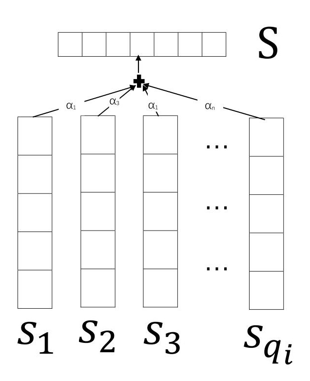

# CNN_NRE  
本项目是本科毕业论文"基于深度学习的实体关系抽取方法与实现"中的实验部分.

## 项目结构
本项目主要分为两个部分, 分别对应SemEval目录和NYT目录.
模型的整体结构如下图所示:

### SemEval

SemEval目录中, 基于了CNN方法和Piecewise CNN(PCNN)方法, 使用SemEval Task #8的数据进行实验. 主要参考了[Zeng et al., 2014]和[Zeng et al.,2015]论文.
其中, CNN方法对应下图:

和PCNN模型如下所示:

### NYT

NYT目录中使用远程监督（Distant Supervision）的方式来解决训练数据缺失的问题, 同时在Multi Instances方法框架下, 使用Attention机制来减小噪声数据带来的影响, 并在句子层面也创新性的加入Attention机制, 强化重要单词. 实验使用[Tensorflow_NRE](https://github.com/ShivneshKumar/Tensorflow_NRE)项目中做的纽约时报语料库与freebase对齐后的数据, 并且很多代码也参考了该项目的代码. 主要参考了[Lin et al., 2016]这篇论文.

Selective Attention over Instances示意图如下所示:

Selective Attention over Words示意图如下所示:

## Reference
[Zeng et al., 2014] Daojian Zeng, Kang Liu, Siwei Lai, Guangyou Zhou, and Jun Zhao. Relation classification via convolutional deep neural network. In Proceedings of COLING.  
[Zeng et al.,2015] Daojian Zeng,Kang Liu,Yubo Chen,and Jun Zhao. Distant supervision for relation extraction via piecewise convolutional neural networks. In Proceedings of EMNLP.  
[Lin et al., 2016] Yankai Lin, Shiqi Shen, Zhiyuan Liu, Huanbo Luan, and Maosong Sun. Neural Relation Extraction with Selective Attention over Instances. In Proceedings of ACL.  
